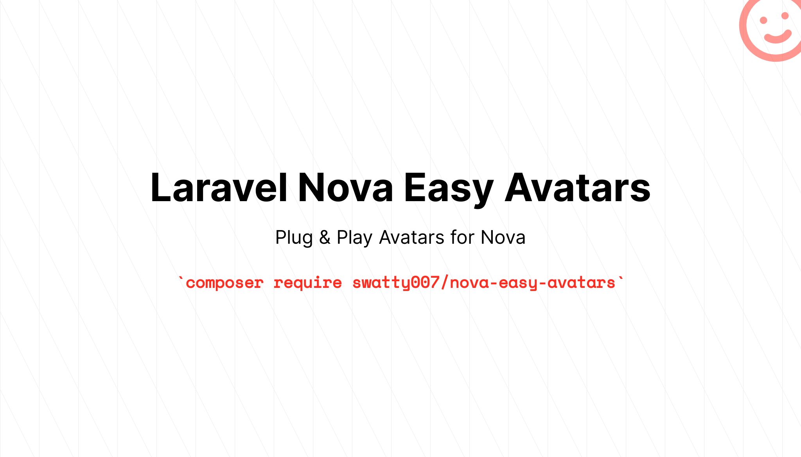

# Laravel Nova Easy Avatars



[](https://packagist.org/packages/swatty007/nova-easy-avatars)
[](https://opensource.org/licenses/MIT)
[](https://scrutinizer-ci.com/g/swatty007/nova-easy-avatars)
[](https://packagist.org/packages/swatty007/nova-easy-avatars)

A small set of additional Avatars types to extend your Nova Panel. Plug & Play.

## Installation

You can install the package via composer:

```bash
composer require swatty007/nova-easy-avatars
```

## Configuration
All fields work without any additional configuration out of the box.
You can however, overwrite their Name & Attribute fields to your liking as on any other Nova field.
Furthermore, you can control the size of your avatars with the **setSize()** method.

The Laravolt based Initials field gives you some extra controls over the look & feel of your Avatar via its configuration file.
For details check out the package's documentation under: https://github.com/laravolt/avatar
> This is helpful, if you want to generate Avatars with a unique color scheme, which matches your application!

## Usage
You can use all available Avatar fields in the same way as Novas build in fields.

``` php
use Swatty007\NovaEasyAvatars\Fields\Initials;

public function fields(Request $request)
    {
        return [
            ...
            Initials::make('Avatar', 'name')
                    ->setSize(350),
            ...
        ]
    
```

The package currently supports the following Avatar Types:
- Identicon via https://github.com/yzalis/Identicon
- Initials via https://github.com/laravolt/avatar

### Changelog

Please see [CHANGELOG](CHANGELOG.md) for more information what has changed recently.

## TODO

- If someone has an idea how to write tests for Nova fields, pull Requests are welcome :monocle_face:

## Contributing

Please see [CONTRIBUTING](CONTRIBUTING.md) for details.

### Security

If you discover any security related issues, please email info@martin-niehoff.de instead of using the issue tracker.

## Credits

- [Martin Niehoff](https://github.com/swatty007)
- [All Contributors](../../contributors)

## License

The MIT License (MIT). Please see [License File](LICENSE.md) for more information.
